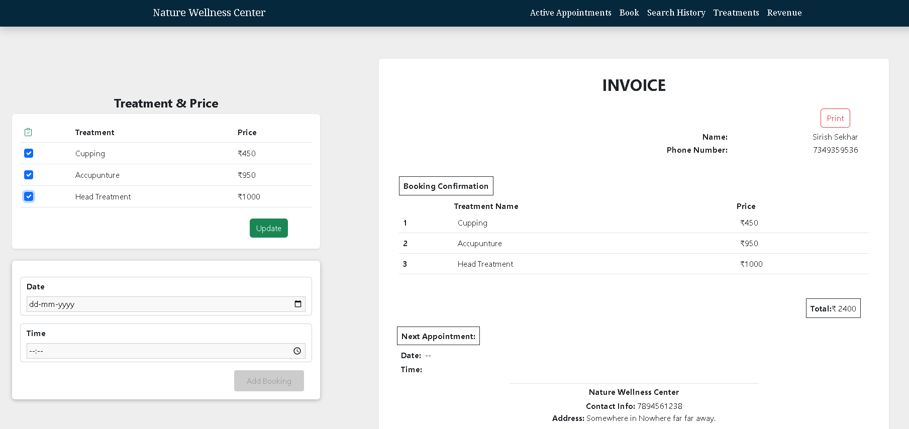
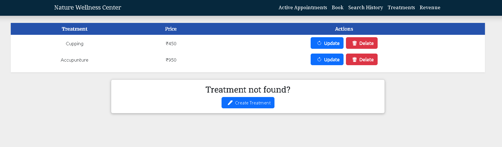

## **Fullstack-Application/Booking-System(MERN)**

A Fullstack Application built for a client using MERN and is intended to serve the purpose of a employee oriented online booking system for easy tracking of data,
below is the demo version of the application with all CRUD operations Implemented

---

### Features:

- Custom Billing System Catered To Clients Needs
- Historical Data Review And All Patients Info And Diagnosis
- Revenue Generated And Number Of Appointments Report
- Easy To Use Modern UI With All CRUD Operations
---
## Technology Stack used:
  
```
  Backend -- Node,Express,MongoDB
  Frontend -- React,Bootstrap
  Deployment -- Heroku
```
 Main Page
 

 
 Billing
 


 Search
 


 Revenue
 


 Treatment
 


 Booking Form
 


   
## Installation Procedure:

#### Download the repository. Structure of the repository is shown below:

```
   FullStack/Appointment-Booking-Website
   |-- Backend 
   |-- Frontend
```

---

#### **Run the backend :**

#### 1. Go to backend directory and install dependencies

```
cd backend

npm install
```

#### 2. Run the server

```
npm start
```

#### **Run the frontend:**

#### 1. Go to frontend directory and install dependencies

```
cd Frontend

npm install
```

#### 2. Run the server

```
npm start
```

Frontend will be live at http://localhost:3000/

Backend will be live at http://localhost:5000/


## Team Members:

Frontend/Backend
* <a href = "https://github.com/sirish123" >Sirish Sekhar </a>

UI/UX Design
* <a href = "https://github.com/S1ddh4rthaG" >Siddhartha Gandu</a>
